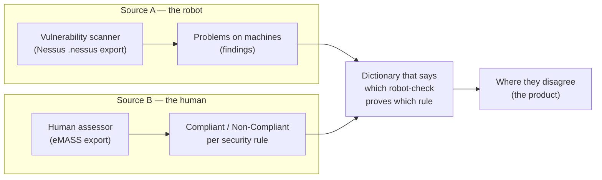
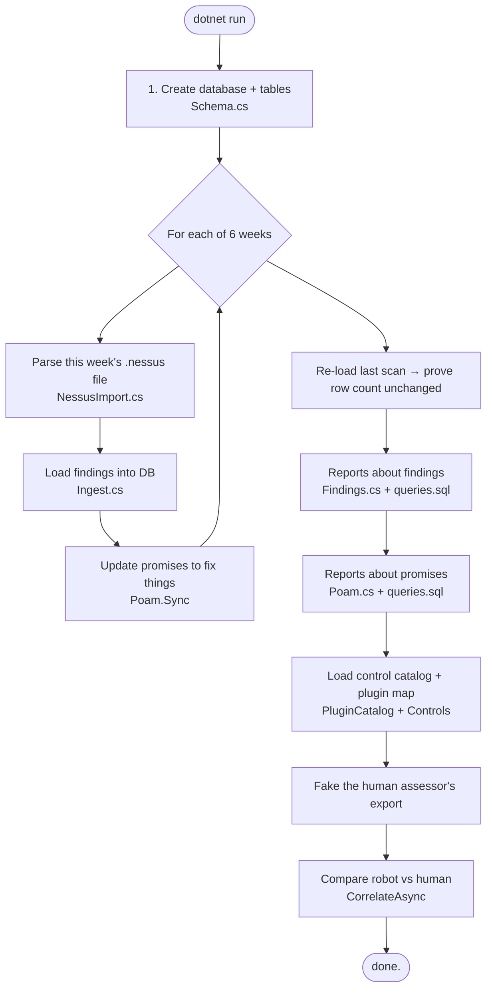
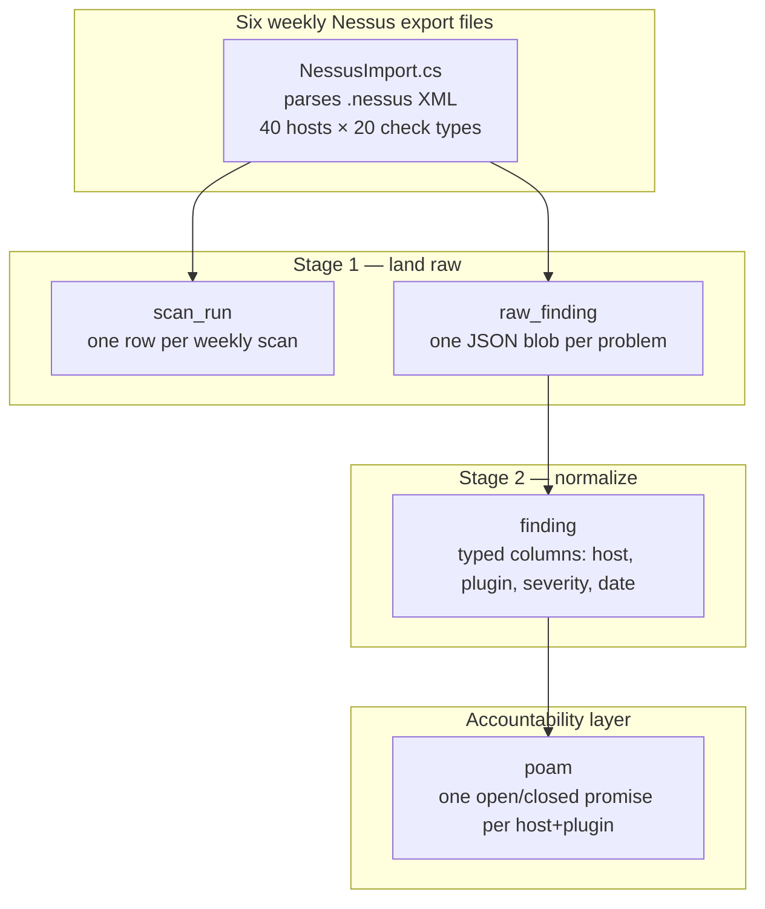
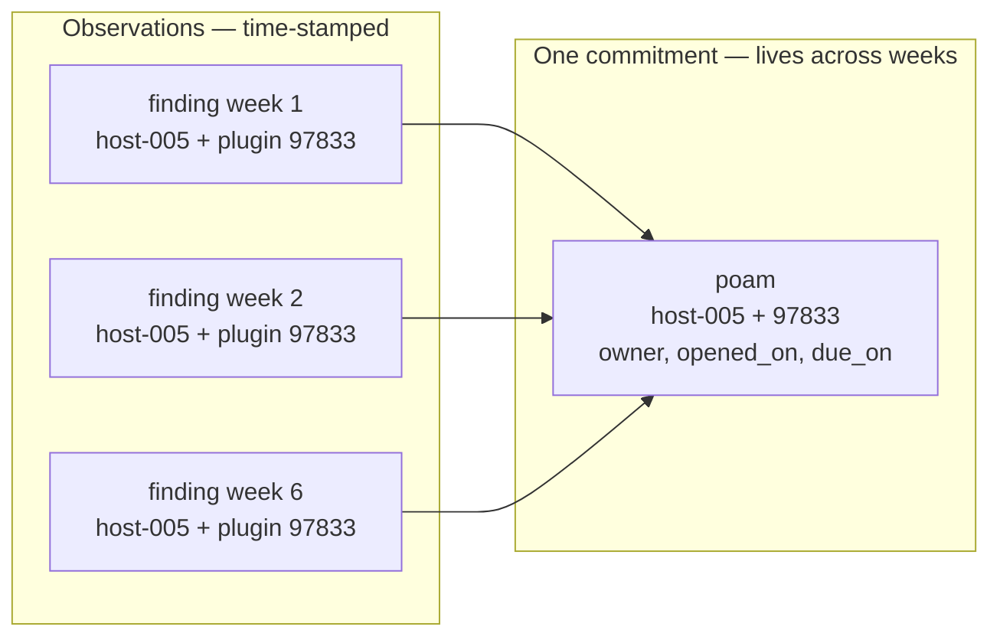
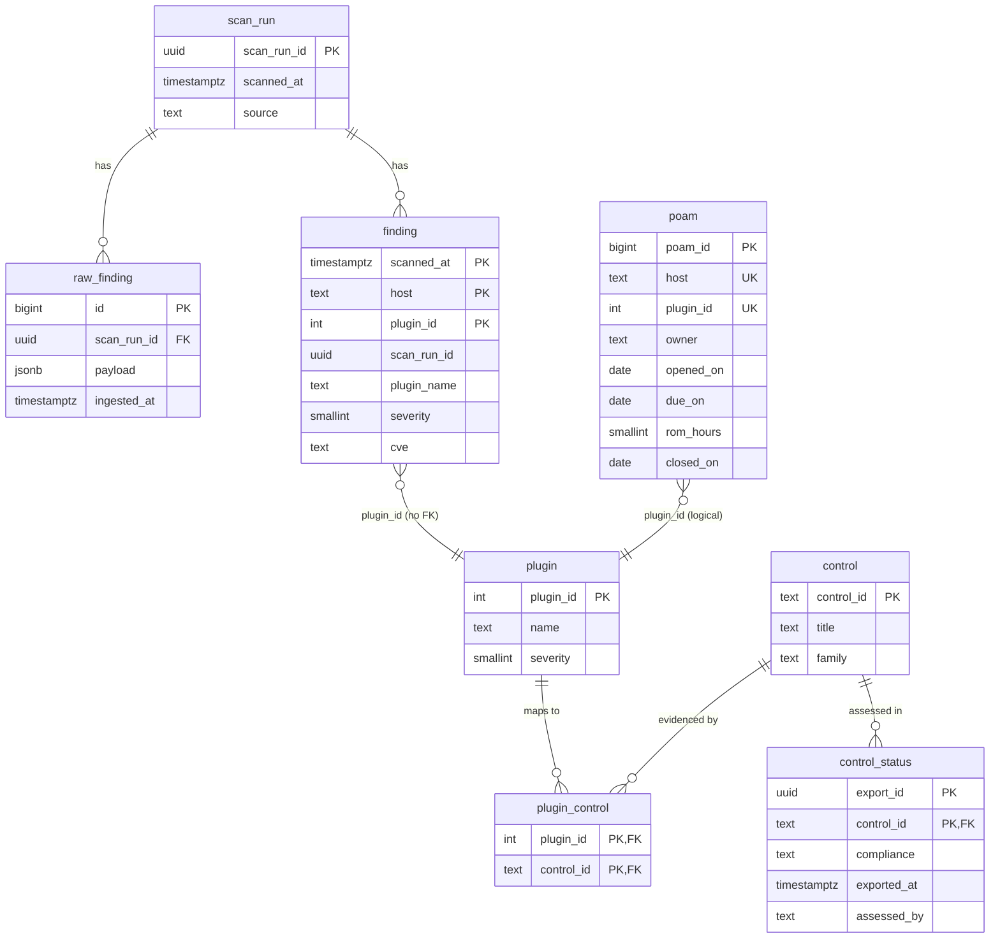
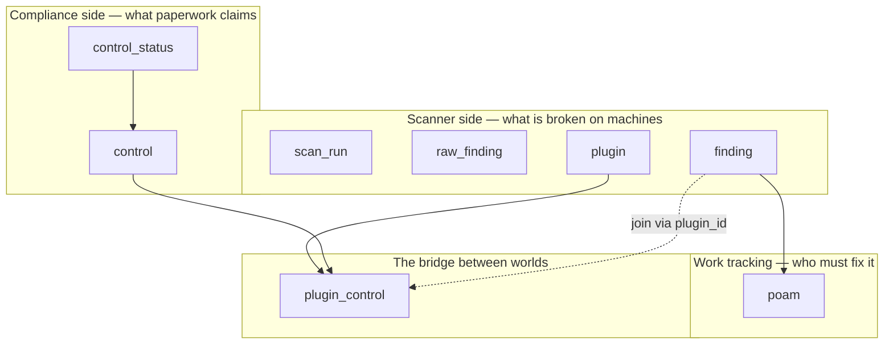
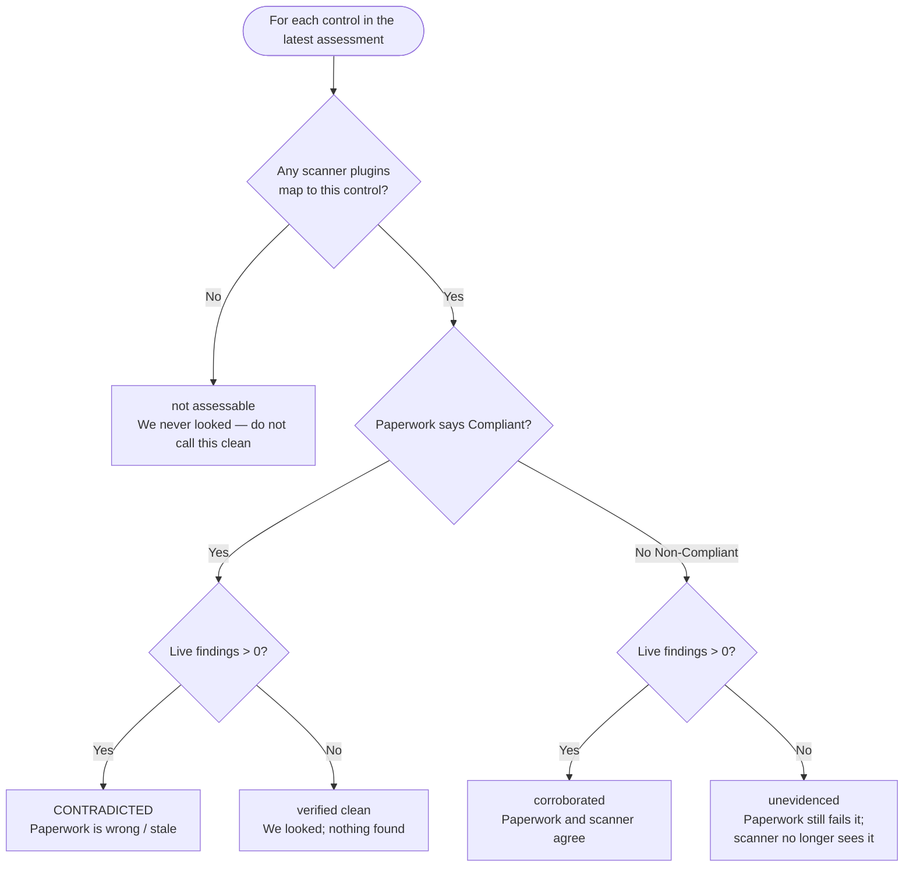
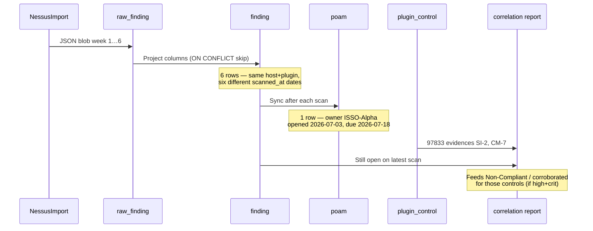
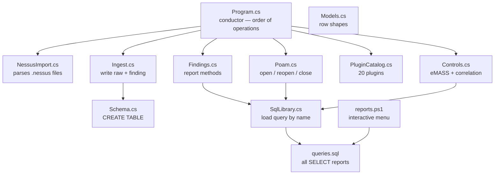

# scan-ingest — a plain-language map

This document is for someone who has never worked in cybersecurity.
It answers three questions:

1. **What is this project trying to do?**
2. **What are the tables, and how do they connect?**
3. **How does data get into those tables?**

It does **not** replace the code comments, the [README](README.md), or the
hands-on [tutorial](TUTORIAL.md). Those go deep. This one is the map you hold
while reading them.

---

## 1. The story in one page

Imagine a large office building that must stay certified to operate.

Two different people check the building:

| Who | How they work | What they produce |
|-----|---------------|-------------------|
| **A robot inspector** that walks every room every week | Automatic, thorough, noisy | A long list of *problems on specific machines* |
| **A human assessor** who visits a few times a year | Slow, careful, authoritative | A short list of *yes/no answers* about security rules |

They use different languages:

- The robot says: *“host-005 still has SMBv1 enabled.”*
- The human says: *“Control CM-6 (Configuration Settings) is Compliant.”*

**This project’s job is to put both lists in one database and find where they
disagree.**

The most valuable finding is:

> The human said **Compliant**, but the robot is still reporting problems that
> prove that control is broken.

That means the official paperwork describes a system that no longer matches
reality.

Everything else in this project (six weekly scans, commitments with owners and
deadlines, aging reports) exists to make that comparison honest and useful.



---

## 2. Everyday vocabulary (no acronym soup)

Security teams use dense jargon. Here are the same ideas in ordinary English.
(The official terms are in parentheses so you can match them to the code.)

| Plain English | Official term | What it is in this project |
|---------------|---------------|----------------------------|
| Permission to run the system | ATO (Authority to Operate) | Background context — not a table |
| Process for getting that permission | RMF (Risk Management Framework) | Background context |
| One security rule on a checklist | Control (NIST 800-53, e.g. `SC-8`) | Row in `control` |
| One automatic check the robot knows | Plugin (Nessus plugin) | Row in `plugin` |
| One problem on one machine this week | Finding | Row in `finding` (and earlier in `raw_finding`) |
| “Someone promised to fix this by a date” | POA&M | Row in `poam` |
| Official system of record for the checklist | eMASS | Simulated by `control_status` |
| Severity of a problem | 0–4 | info → low → medium → high → critical |

**Severity scale used everywhere:**

| Number | Word | Rough meaning |
|--------|------|----------------|
| 4 | critical | Fix immediately |
| 3 | high | Fix soon |
| 2 | medium | Fix on a schedule |
| 1 | low | Fix when convenient |
| 0 | info | Not really a vulnerability (often scanner housekeeping) |

---

## 3. What runs when you type `dotnet run`

The program is a **one-shot batch demo**, not a always-on service. It runs top to
bottom once, prints 13 sections, and exits.



| Section on screen | What happened |
|-------------------|---------------|
| `[1]` schema | Empty (or existing) database is ready |
| `[2]` ingest | Six weekly scans loaded; after each, POA&Ms open/reopen/close |
| `[3]` idempotency | Same last scan loaded again — counts must not double |
| `[4]`–`[7]` | Questions about *what the scanner saw* |
| `[8]`–`[10]` | Questions about *who promised to fix what, and by when* |
| `[11]`–`[13]` | Second source + the disagreement report |

**Important:** the scan files are **real Nessus format but not a real network** —
they describe a fictional forty-host estate, so nothing here scans anything. The
files are fixed on disk, so the numbers never move, which is why the tutorial can
say “you should see 1730 findings.”

---

## 4. How data is produced (the pipeline)

There are three layers of “truth” about a problem:



### Why two tables for the same findings?

| Table | Role | Analogy |
|-------|------|---------|
| `raw_finding` | Inbox — store the scanner payload as JSON | Unopened mail |
| `finding` | Filing cabinet — typed, queryable, no duplicates | Sorted records |

Postgres’s fastest bulk load (`COPY`) cannot say “skip duplicates.”
So the design is:

1. Pour everything into the inbox fast.
2. Copy into the filing cabinet with `ON CONFLICT DO NOTHING`.

That is why re-running the program does not double the data.

### Identity rules (the keys)

| Thing | Identity | Why |
|-------|----------|-----|
| One scan | `(source, scanned_at)` / fixed UUID | Same scan replayed must look like the *same* scan |
| One finding | `(scanned_at, host, plugin_id)` | Same problem on same machine in same scan = one row |
| One promise (POA&M) | `(host, plugin_id)` | The promise is about the *problem*, not about one week |



If the problem disappears from a later scan, the POA&M gets a `closed_on` date.
If it comes back, the **same** POA&M row reopens (the clock is not reset — that
would hide a recurring failure).

### Deadlines (SLA)

When a POA&M opens, the due date is set once from severity and never recalculated:

| Severity | Days to fix | Effort estimate (ROM hours) |
|----------|-------------|-----------------------------|
| critical | 15 | 16 |
| high | 30 | 8 |
| medium | 90 | 4 |
| low | 180 | 2 |
| info | 365 | 1 |

The demo only spans **five weeks** (six weekly scans). So only criticals and
highs can actually go overdue in this data. “Zero overdue mediums” means the
window is short — not that mediums are always fixed on time.

---

## 5. The tables — big picture

There are **eight logical tables** (plus monthly partition tables under `finding`).



### Group them by purpose



| Group | Tables | Question they answer |
|-------|--------|----------------------|
| Scanner | `scan_run`, `raw_finding`, `finding`, `plugin` | What did the robot see, when? |
| Work | `poam` | Who owns the fix, and is it late? |
| Compliance | `control`, `control_status` | What did the human claim? |
| Bridge | `plugin_control` | Which robot checks count as evidence for which rules? |

Without `plugin_control`, the two sources cannot be joined. The robot speaks
“host + plugin”; the human speaks “control ID.” The bridge is the dictionary.

---

## 6. Table-by-table, in plain English

### `scan_run` — one weekly inspection

| Column | Meaning |
|--------|---------|
| `scan_run_id` | Stable ID for this run (derived from source + timestamp, not random) |
| `scanned_at` | When the scan happened |
| `source` | Who produced it (`acas-nessus` here) |
| `ingested_at` | When *this program* loaded it (wall clock) |

There are **six** of these in a full run (2026-07-03 through 2026-08-07).

### `raw_finding` — untouched scanner payload

One row per problem, stored as JSON. Example:

```json
{
  "host": "host-005.mil",
  "plugin_id": 97833,
  "plugin_name": "SMBv1 Remote Code Execution",
  "severity": 4,
  "cve": "CVE-2017-0143"
}
```

Duplicates are allowed here. Dedup happens when projecting into `finding`.

### `finding` — the fact table (history kept)

One row = **one problem on one host in one scan**.

Keeping history matters: six rows for the same host+plugin across six weeks means
“ignored for five weeks,” which is a different fact from “found once.”

Physically split by month (`finding_2026_07`, `finding_2026_08`) so old data can
be dropped by detaching a partition instead of deleting millions of rows.

### `poam` — the promise register

| Column | Meaning |
|--------|---------|
| `host` + `plugin_id` | Which problem |
| `owner` | Who is accountable (demo uses `ISSO-Alpha` … `ISSO-Foxtrot`) |
| `opened_on` | First day the problem was *seen* (not when someone wrote it down) |
| `due_on` | Promise deadline (severity-based SLA) |
| `rom_hours` | Rough effort to fix |
| `closed_on` | Null if still open; set when the problem stops appearing |

This table is **not** partitioned by scan date. A promise outlives the week that
discovered it.

### `plugin` — dictionary of robot checks

Twenty checks in this demo (real Nessus-style names/ids). Stable IDs let you
track “plugin 97833” across every scan forever.

### `control` — dictionary of security rules

Ten NIST-style controls. Some a scanner can test (crypto, patching,
configuration); some it never can (account management procedures, human review
of audit logs).

### `plugin_control` — many-to-many evidence map

“Plugin 97833 counts as evidence for control SI-2 and CM-7.”

This mapping is **policy** written by humans. It is incomplete on purpose:

- Some plugins map to nothing (scanner housekeeping).
- Some controls have no plugins (procedural rules).

Both gaps show up in the reports.

### `control_status` — the human’s verdict snapshot

| Column | Meaning |
|--------|---------|
| `export_id` | Which assessment package |
| `control_id` | Which rule |
| `compliance` | `Compliant` or `Non-Compliant` only |
| `exported_at` | When the assessment was made |
| `assessed_by` | Who signed it (`SCA-Team-1`) |

In this demo the export is **dated to the first scan** — deliberately five weeks
stale relative to the latest scan. That staleness is realistic and is what makes
contradictions appear without hand-planting lies.

---

## 7. The second half: comparing robot and human

After all six scans and POA&M sync, the program:

1. Seeds `plugin` and `control` / `plugin_control`.
2. Builds a synthetic eMASS export into `control_status`.
3. Runs the correlation query.

### How the assessor decides Compliant vs Non-Compliant (in this demo)

At assessment time (first scan only), a control is marked **Non-Compliant** only
if there was at least one **high or critical** finding mapping to it.

Low and informational findings are ignored by the assessor (normal triage) but
still reported by the scanner every week. That asymmetry is how
**CONTRADICTED** rows appear for controls the paperwork still calls clean.

### The five verdicts



| Verdict | In one sentence |
|---------|-----------------|
| **CONTRADICTED** | Human said fine; robot says broken. Escalate. |
| **not assessable** | No robot check can see this rule at all. |
| **corroborated** | Both sides say bad. Honest tracking. |
| **unevidenced** | Human still says bad; robot no longer sees it. |
| **verified clean** | Human says fine; robot found nothing. Ignore. |

There is also a **mirror-image** report (`UncoveredAsync`): findings whose plugins
map to **no** tracked control. Either the dictionary is incomplete, or the
authorization package has nowhere to file the risk.

---

## 8. Example: follow one problem across tables

**Problem:** `host-005.mil` has SMBv1 enabled (plugin `97833`, severity critical).



| Step | Table | What you see |
|------|-------|--------------|
| 1 | `raw_finding` | JSON with host, plugin 97833, severity 4 |
| 2 | `finding` | Six historical rows (one per week) |
| 3 | `poam` | One open commitment, due 15 days after first seen |
| 4 | `plugin_control` | Maps 97833 → `SI-2`, `CM-7` |
| 5 | Reports | Overdue if past due; counts toward those controls |

---

## 9. How the source files fit together



| File | Owns |
|------|------|
| `Program.cs` | The storyboard (what happens in which order) |
| `NessusImport.cs` | Parses Nessus `.nessus` export files (no database) |
| `samples/weekly/` | Six weekly `.nessus` exports — the program's default input |
| `Ingest.cs` | Writes `scan_run`, `raw_finding`, `finding` |
| `Schema.cs` | All table definitions and partitions |
| `Poam.cs` | Writes/updates `poam`; some POA&M reports |
| `Findings.cs` | Scanner-side reports |
| `Controls.cs` | Seeds controls + evidence; correlation reports |
| `PluginCatalog.cs` | Seeds `plugin` |
| `Models.cs` | C# types that match query result columns |
| `SqlLibrary.cs` | Parses `queries.sql` once, serves SQL by name |
| `queries.sql` | **Single** home of all read-only report SQL |
| `reports.ps1` | Menu that runs those same queries one at a time |

**Writes** (INSERT/UPDATE/CREATE) live in C#.  
**Reads** (SELECT reports) live in `queries.sql` and are shared by the C# app and
the PowerShell menu. Edit one place; both consumers change.

---

## 10. Mental model cheat sheet

Keep these distinctions; almost every confusing comment in the code is about one
of them:

| Do not confuse… | With… |
|-----------------|-------|
| **Finding** (observation) | **POA&M** (commitment with owner + deadline) |
| **`scanned_at`** (when the robot looked) | **`ingested_at`** (when the program loaded the file) |
| **`opened_on`** (first time seen) | Day the POA&M was written |
| **Plugin** (a check) | **Control** (a security rule) |
| **Compliant on paper** | **Verified clean by the scanner** |
| **Zero findings** + **zero plugins** | Clean — it is *not assessable* |
| **Count across all scans** | Count for the **latest** scan only |

**Rule of thumb for reports:** historical tables keep every week. Almost every
“how many open problems?” query first picks the **latest** `scan_run`, then
counts only that week. Without that filter, the same problem is counted six
times.

---

## 11. Where to go next

| If you want… | Open… |
|--------------|-------|
| To install and walk the data yourself | [TUTORIAL.md](TUTORIAL.md) |
| Design decisions and real bugs fixed | [README.md](README.md) |
| Exact column definitions and why | `Schema.cs` comments |
| How one scan lands | `Ingest.cs` |
| How promises open/close | `Poam.cs` → `SyncAsync` |
| How contradictions are scored | `Controls.cs` + `CorrelateAsync` in `queries.sql` |
| To run one report and see its SQL | `.\reports.ps1` |

---

## 12. One-sentence summary

**scan-ingest loads six weeks of fake vulnerability scans into Postgres, turns
each open problem into an owned promise with a deadline, then compares that live
evidence to a stale human compliance checklist — and the product is the list of
places those two views of security disagree.**
